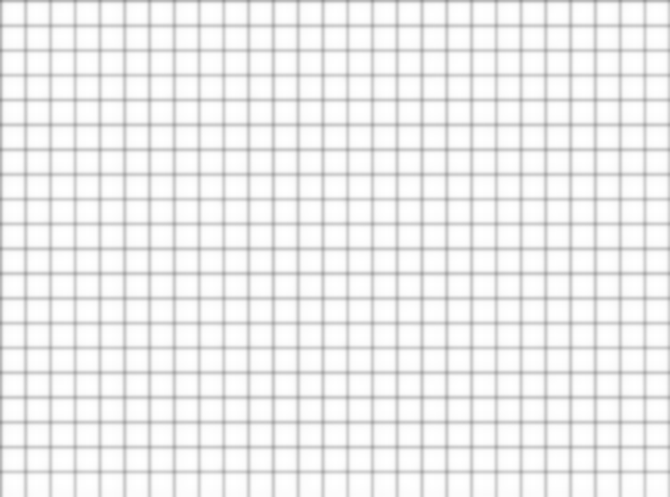
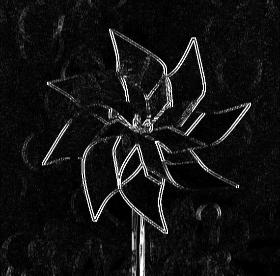

# Project 2: Filter

Please fill this out for Filter only. The project handout can be found [here](https://cs1230.graphics/projects/raster/2).

## Output Comparison

This is how you will demonstrate the functionality of your project.

Unlike Brush, you will be submitting images instead of videos for Filter.

We provide the functionality for saving the canvas of your running Filter program to a file. By default, the save dialog should open to the `student_outputs` folder, which is where the table below expects your images to be. If it does not, check that you have set your working directory to the root of the project (i.e. the folder that contains `CMakeLists.txt`).

**Do not** use your system screenshot tool or any other method to capture the canvas. You must use the save functionality provided by the program.

> Note: once all images are filled in, the images will be the same size in the expected and student outputs.

|                                                                                             Instructions                                                                                              |                             Expected Output                             |                                      Your Output                                      |
| :---------------------------------------------------------------------------------------------------------------------------------------------------------------------------------------------------: | :---------------------------------------------------------------------: | :-----------------------------------------------------------------------------------: |
|                           Load `fun_images/grid.jpeg`. Select "Blur" and set the radius to **0**. Click "Apply Filter". Save the image to `student_outputs/grid_blur_0.png`                           |    |    |
|                   Load `fun_images/grid.jpeg`. Select "Blur" and set the radius to **2**. Click "Apply Filter" **three times**. Save the image to `student_outputs/grid_blur_2.png`                   |    |    |
|                          Load `fun_images/edge.png`. Select "Blur" and set the radius to **10**. Click "Apply Filter". Save the image to `student_outputs/edge_blur_10.png`                           |  |  |
|                    Load `fun_images/edge.png`. Select "Edge detect" and set the sensitivity to **0.20**. Click "Apply Filter". Save the image to `student_outputs/edge_edge_1.png`                    |    |    |
|            Load `fun_images/edge.png`. Select "Edge detect" and set the sensitivity to **0.50**. Click "Apply Filter" **three times**. Save the image to `student_outputs/edge_edge_2.png`            |    |    |
|                    Load `fun_images/mona_lisa.jpg`. Select "Scale" and set **x to 0.20 and y to 1.00**. Click "Apply Filter". Save the image to `student_outputs/mona_lisa_1.png`                     |    |    |
|                    Load `fun_images/mona_lisa.jpg`. Select "Scale" and set **x to 1.00 and y to 0.20**. Click "Apply Filter". Save the image to `student_outputs/mona_lisa_2.png`                     |    |    |
|                        Load `fun_images/mona_lisa.jpg`. Select "Scale" and set **x and y to 0.20**. Click "Apply Filter". Save the image to `student_outputs/mona_lisa_3.png`                         |    |    |
| Load `fun_images/amongus.jpg`. Select "Scale" and set **x and y to 0.20**. Click "Apply Filter". Then set **x and y to 5.00.**. Click "Apply Filter". Save the image to `student_outputs/amongus.png` |            |                |
|                         Load `fun_images/andy.jpeg`. Select "Scale" and set **x to 1.40 and y to 1.00**. Click "Apply Filter". Save the image to `student_outputs/andy_1.png`                         |              |                      |
|                         Load `fun_images/andy.jpeg`. Select "Scale" and set **x to 1.00 and y to 1.40**. Click "Apply Filter". Save the image to `student_outputs/andy_2.png`                         |              |                      |

## Design Choices
I separate out functions for scale from blur and edge detection just for the convenience of debugging.
Blur and edge detection shares the same convolve function, using a boolean as an indicator to check whether 
use the input image or the RGBA float image stored earlier. 

## Collaboration/References
Huge thanks to all the TAs! 

## Known Bugs
N/A

## Extra Credit
N/A
